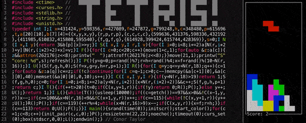

# tinytetris
80x23 terminal tetris




## tinytetris.cpp
This is the 80x23 version. You control it with a (left), d (right), w (rotate), s (drop), and q (quit). It depends on curses.h (so you'll need to compile with -lcurses, and install curses if you don't already have it) and requires C++11.

## How to build
```C++
g++ -o tinytetris tinytetris.cpp -lncurses
```
I run this on MacOS Monterey